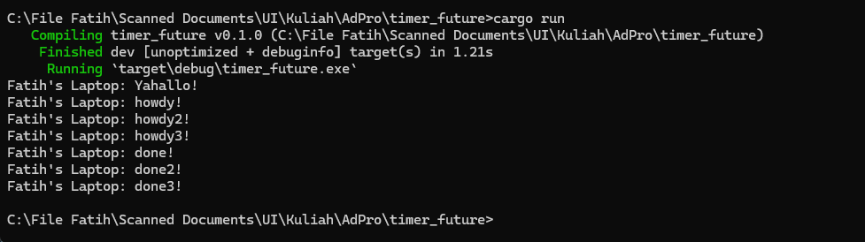
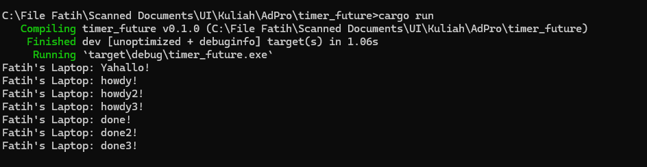

**1.2. Understanding how it works.**  
  
From the output, we can understand that the aysnc function runs outside the main function that is running it(the async). That is why the message 'yahallo' from the code `println!("Yahallo!");` goes first in the output, because the async function, like the name, is asynchronous to the main function. 

**1.3.A Without dropping spawner**

**1.3.B With dropping spawner**

**1.3. Multiple Spawn and removing drop**
With us dropping the spawner, the program doesn't seems to close itself because the terminal is still running it, I think, this is because if we didn't drop the spawner, the program will think that there will be more inputs coming from the spawner, and with us dropping the spawner, it knows that there will be no more spawn, thus the program closes.