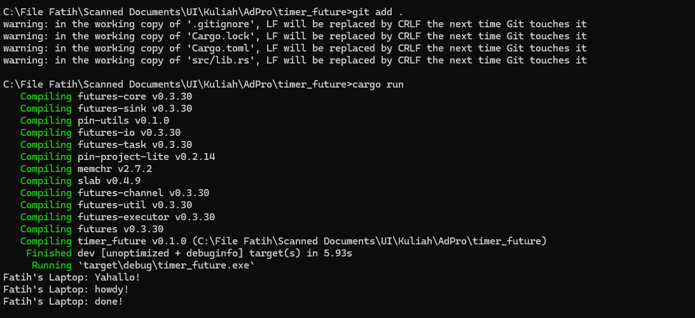

**1.2. Understanding how it works.**  
  
From the output, we can understand that the aysnc function runs outside the main function that is running it(the async). That is why the message 'yahallo' from the code `println!("Yahallo!");` goes first in the output, because the async function, like the name, is asynchronous to the main function. 
